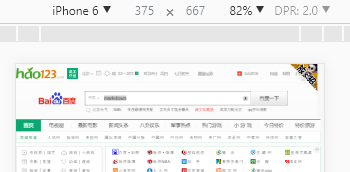

## 移动端相关概念

#### 1、移动端简介

1. 

#### 2、移动端测试环境

1. pc端模拟环境测试

    chrome调试台进行测试

2. 真机测试

    本人常用 [ngrok](https://www.ngrok.cc/ 'ngrok官网')进行映射,感觉不错

    [更多方法](https://www.zhihu.com/question/20322475 '知乎question')

#### 3、像素概念

  1. 设备独立像素
  2. 设备像素
  3. 像素比
  4. 普通屏与高清屏的概念
  5. 普通屏与高清屏在移动端的区别

设备像素比 = 设备像素/设备独立像素

>设备像素比(dpr) :是指在移动开发中1个css像素占用多少设备像素

>设备像素:设备像素又称物理像素（physical pixel），设备能控制显示的最小单位，我们可以把这些像素看作成显示器上一个个的点。

>设备独立像素：(也叫密度无关像素)，可以认为是计算机坐标系统中的一个点，这个点代表一个可以由程序使用并控制的虚拟像素(比如：CSS 像素,只是在android机中CSS 像素就不叫”CSS 像素”了而是叫”设备独立像素”)，然后由相关系统转换为物理像素

> iphone6 为例  1334*750 像素分辨率  375为css像素  dpr = 750/375 = 2



- 在此不做详细解释，具体可以看

[CSS像素、物理像素、逻辑像素、设备像素比、PPI、Viewport](https://github.com/jawil/blog/issues/21)

[移动前端开发之viewport的深入理解](http://www.cnblogs.com/2050/p/3877280.html)

#### 4、viewport

viewport的各个参数的概念以及设置方式


#### 5、像素比

像素比与设计图的关系
 
## 移动端适配方案

1. 百分比适配
2. viewport适配（两种适配方案）
3. rem适配（两种适配方案）
4. 弹性布局适配
5. 移动端布局中的注意问题
  1、body的overflow问题
  2、固定定位问题
6. 移动端样式重置

淘宝的viewport设置
window.devicePixelRatio 屏幕像素比
```
(function() {
  var scale = 1 / window.devicePixelRatio;
  var meta = document.createElement('meta');
  meta.name = 'viewport'
  meta.content = 'initial-scale=' + scale + ',minimun-scale=' + scale + ',maximum-scale=' + scale;
  document.head.appendChild(meta)
})()
```
rem适配
```
(function() {
  var html = document.documentElement;
  var width = html.getBoundingClientRect().width;
  html.style.fontSize = width / 16 + "px"
    // iphone5下 1rem = 20px 
})()
```
样式重置
```
body {
  font-family: Helvetica;
  margin: 0;
}

body * {
  -webkit-text-size-adjust: 100%;
  -webkit-user-select: none;
}

a,
button,
input {
  -webkit-tap-highlight-color: rgba(0, 0, 0, 0)
}

button,
input {
  -webkit-appearance: none;
  border-radius: 0;
}

a {
  text-decoration: none;
}

input {
  outline: none;
  vertical-align: middle;
}
```
