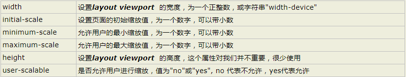

## 移动端相关概念

#### 1、移动端简介

1. 

#### 2、移动端测试环境

1. pc端模拟环境测试

    chrome调试台进行测试

2. 真机测试

    本人常用 [ngrok](https://www.ngrok.cc/ 'ngrok官网')进行映射,感觉不错

    [更多方法](https://www.zhihu.com/question/20322475 '知乎question')

#### 3、像素概念

  1. 设备独立像素
  2. 设备像素
  3. 像素比
  4. 普通屏与高清屏的概念
  5. 普通屏与高清屏在移动端的区别

设备像素比 = 设备像素/设备独立像素

>设备像素比(dpr) :是指在移动开发中1个css像素占用多少设备像素

>设备像素:设备像素又称物理像素（physical pixel），设备能控制显示的最小单位，我们可以把这些像素看作成显示器上一个个的点。

>设备独立像素：(也叫密度无关像素)，可以认为是计算机坐标系统中的一个点，这个点代表一个可以由程序使用并控制的虚拟像素(比如：CSS 像素,只是在android机中CSS 像素就不叫”CSS 像素”了而是叫”设备独立像素”)，然后由相关系统转换为物理像素

> iphone6 为例  1334*750 像素分辨率  375为css像素  dpr = 750/375 = 2


- 在此不做详细解释，具体可以看

[CSS像素、物理像素、逻辑像素、设备像素比、PPI、Viewport](https://github.com/jawil/blog/issues/21)

[移动前端开发之viewport的深入理解](http://www.cnblogs.com/2050/p/3877280.html)

#### 4、viewport

viewport的各个参数的概念以及设置方式


 
## 移动端适配方案

1. [百分比适配](https://github.com/iiLsss/mobile/blob/master/%E7%99%BE%E5%88%86%E6%AF%94%E9%80%82%E9%85%8D.html)
2. [viewport适配](https://github.com/iiLsss/mobile/blob/master/viewport%E9%80%82%E9%85%8D.html)（两种适配方案）
3. [rem适配](https://github.com/iiLsss/mobile/blob/master/rem%E9%80%82%E9%85%8D.html)（两种适配方案）
4. 弹性布局适配
5. 移动端布局中的注意问题
  1、body的overflow问题
  2、固定定位问题
6. 移动端样式重置


- 淘宝的viewport设置
window.devicePixelRatio 屏幕像素比
```
(function() {
  var scale = 1 / window.devicePixelRatio;
  var meta = document.createElement('meta');
  meta.name = 'viewport'
  meta.content = 'initial-scale=' + scale + ',minimun-scale=' + scale + ',maximum-scale=' + scale;
  document.head.appendChild(meta)
})()
```

- rem适配

```
(function() {
  var html = document.documentElement;
  var width = html.getBoundingClientRect().width;
  html.style.fontSize = width / 16 + "px"
    // iphone5下 1rem = 20px 
})()
```

- 样式重置

```
body {
  font-family: Helvetica;
  margin: 0;
}

body * {
  -webkit-text-size-adjust: 100%;
  -webkit-user-select: none;
}

a,
button,
input {
  -webkit-tap-highlight-color: rgba(0, 0, 0, 0)
}

button,
input {
  -webkit-appearance: none;
  border-radius: 0;
}

a {
  text-decoration: none;
}

input {
  outline: none;
  vertical-align: middle;
}

    html {
        /*  font-size: 62.5%;为了更好的计算，兼容更多不同分辨率的屏幕，使用js计算根节点字体大小*/
        width: 100%;
        height: 100%;
        overflow: hidden;
        /* 禁止出现滚动条影响美观 */
        -webkit-transform: translate3d(0, 0, 0);
        /*  在部分android机型的微信环境中会出现事件无法触发、表单无法输入的情况，我们针对需要输入或者触发事件的元素设置样式：
        -webkit-transform: translate3d(0,0,0) ，不过新版本的微信已经直接修复了该问题,仅仅为了兼容低版本微信。 */
    }
    body {
        font-size: 0.14rem;
        /* 14÷100=0.14*/
        width: 100%;
        height: 100%;
        overflow: hidden;
        /* 禁止出现滚动条影响美观 */
        position: absolute;
        top: 0;
        left: 0;
        /* 解决微信下vue获取内容的bug */
        font-family: "Helvetica Neue", Helvetica, STHeiTi, sans-serif;
        /*使用无衬线字体*/
        -webkit-text-size-adjust: 100%!important;
        /*禁止IOS调整字体大小*/
    }
    html,
    body {
        -webkit-user-select: none;
        /*禁止选中文本*/
        user-select: none;
    }
    /* 去掉浏览器各种蛋疼的好丑的样式 */
    a,
    img {
        -webkit-touch-callout: none;
        /*禁止长按链接与图片弹出菜单*/
        border: 0 none;
        /* 1 */
        width: auto;
        /* 2 */
        height: auto;
        /* 3 */
        max-width: 100%;
        /* 4 */
        vertical-align: top;
        /* 5 */
        -ms-interpolation-mode: bicubic;
        /* 6 */
    }
    @media only screen and (min-width: 1024px) {
        /* 表明是PC端就固定字体大小,默认16px ,浏览器默认大小就是16px*/
        body {
            font-size: 16px !important;
            overflow: auto !important;
        }
    }
    button,
    input,
    optgroup,
    select,
    textarea {
        -webkit-appearance: none;
        /*去掉webkit默认的表单样式*/
    }
    a,
    button,
    input,
    optgroup,
    select,
    textarea {
        -webkit-tap-highlight-color: rgba(0, 0, 0, 0);
        /*去掉a、input和button点击时的蓝色外边框和灰色半透明背景*/
    }
    input::-webkit-input-placeholder {
        color: #ccc;
        /*修改webkit中input的planceholder样式*/
        /*   placeholder的文字在ios下可以换行，android不行 */
    }
    input:focus::-webkit-input-placeholder {
        color: #f00;
        /*修改webkit中focus状态下input的planceholder样式*/
    }
    input::-webkit-input-speech-button {
        display: none;
        /*隐藏Android的语音输入按钮*/
    }
    #text {
        border: 1px solid red;
        width: 3.2rem;
        height: 3.2rem;
        font-size: 0.4rem;
    }
    </style>
```
